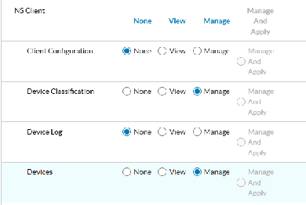
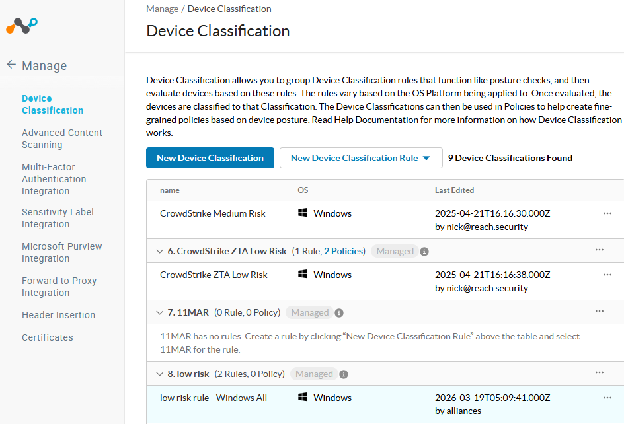
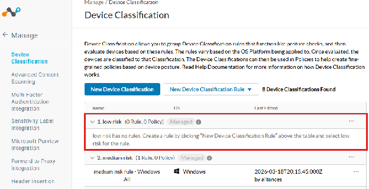
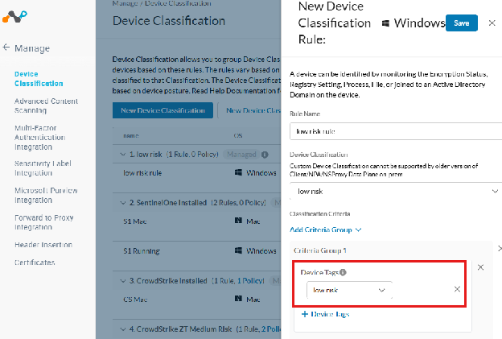
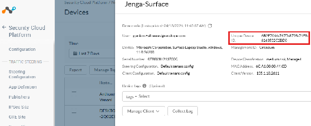
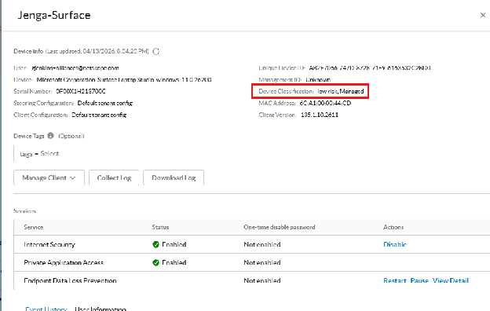
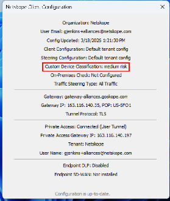
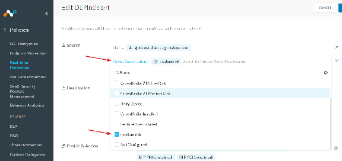
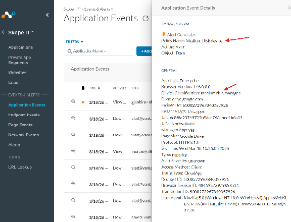

# Device Tags for Classification Integration Guide

Programmatically manage device tags and device classifications within your Netskope environment. Use these workflows to organize devices by custom risk assessment, device type, department, or any other business classification criteria, then drive real-time policy enforcement off those tags.

---

## Overview

The Netskope Device Classification API enables partners and administrators to:
- View existing device tags and classifications
- Create new tags and classification rules
- Look up devices and apply tags to them
- Manage tag lifecycle (update, remove) over time

**Prerequisites:**
- **API Access:** The Device Classification APIs are currently in **beta**. Contact your Netskope account team to request access.
- **API Token:** Generate a token with the following functional area permissions:
  - `Access Control > NS Client` — set both **Device Classification** and **Devices** to **Manage**
  - `CASB > CCI` — set to **View**
- **User-Agent header:** Include a user-agent string formatted as `<Vendor-Product-Version>` in all API requests.



---

## Device Classifications vs. Device Tags

These are two related but distinct systems — most integrations use both together.

### Device Classifications
- **Purpose:** Automatic, rule-based classification
- **How it works:** You create rules that automatically apply a classification label to devices based on conditions (OS type, presence of other tags, AV status, etc.)
- **Applied by:** The rules engine (automatic)
- **Use case:** Static classification based on device characteristics
- **Example IDs:** `18006` ("low risk"), `16341` ("medium risk"), `7841` ("Risky Device")

### Device Tags
- **Purpose:** Manual, explicit tagging for direct device assignment
- **How it works:** You directly assign tags to specific devices via API calls
- **Applied by:** Direct API calls (manual)
- **Use case:** Dynamic tagging based on real-time risk assessment from third-party tools
- **Example IDs:** `1137` ("low risk"), `912` ("Medium Risk")

**Typical pattern:** Your integration writes a **Device Tag** to a device based on a real-time finding, then a pre-configured **Device Classification Rule** checks for that tag (`device_tag_check`) and promotes it into a classification that Netskope policy can match on.

---

## Things to Note

### Batch Processing & Performance
- Devices are processed in batches of **100** (`TAG_DEVICE_BATCH_SIZE`)
- Larger device sets are split into multiple sequential batches
- Each batch triggers a separate Netskope API call

### Tag Validation & Constraints
- **Maximum tag length:** 80 characters
- **Maximum tags per device:** 5 (Netskope platform limit) — for a Replace action, only the first 5 sorted tags are applied
- **Tag name format:** alphanumeric characters, hyphens, and spaces only

### Comma-Separated Value Handling
- **Tags** and **User Key** — split and processed as individual values
- **Device UID** — comma-separated values are rejected
- Empty values after splitting are detected and rejected with validation errors

---

## Available Endpoints

**Tag Management (Device Classification)**

| Method | Endpoint | Description |
|--------|----------|-------------|
| GET | `/api/v2/deviceclassification/tags` | List all device tags |
| POST | `/api/v2/deviceclassification/tags` | Create a new device tag |
| GET | `/api/v2/deviceclassification/tags/{id}` | Retrieve a specific tag by ID |
| PUT | `/api/v2/deviceclassification/tags/{id}` | Update an entire tag |
| PATCH | `/api/v2/deviceclassification/tags/{id}` | Partially update a tag |
| DELETE | `/api/v2/deviceclassification/tags/{id}` | Delete a device tag |
| GET | `/api/v2/deviceclassification/options` | Get available classification options |
| GET | `/api/v2/deviceclassification/rules` | List classification rules |
| POST | `/api/v2/deviceclassification/rules` | Create a classification rule |

**Device Tag Application**

| Method | Endpoint | Description |
|--------|----------|-------------|
| POST | `/api/v2/devices/device/tags` | Create/register a device tag |
| POST | `/api/v2/devices/device/tags/bulkreplace` | Apply tags to one or more devices |
| POST | `/api/v2/devices/device/tags/gettags` | Get tags for a specific device |
| PATCH | `/api/v2/devices/device/tags/{id}` | Update device tag assignment |
| DELETE | `/api/v2/devices/device/tags/{id}` | Remove a tag from a device |

---

## 1. View Existing Device Tags

Retrieve all device classification tags in your Netskope environment.

**Endpoint:** `GET /api/v2/deviceclassification/tags`

```bash
curl -X GET "https://<tenant>.goskope.com/api/v2/deviceclassification/tags" \
  -H "Authorization: Bearer <token>" \
  -H "User-Agent: Partner-RiskAssessment-1.0"
```

**Response:**
```json
[
  {
    "id": 8505,
    "priority": 7,
    "name": "Low Risk",
    "description": "the risk of this device is low",
    "modifiedBy": "test@test.com",
    "modifiedTime": "2025-07-28T08:48:14.000Z",
    "policyNames": ["Low-Risk device"]
  }
]
```



---

## 2. Create a New Device Classification Tag

Create a new classification tag (label). The request body must be an **array of tag objects**.

**Endpoint:** `POST /api/v2/deviceclassification/tags`

```bash
curl -X POST "https://<tenant>.goskope.com/api/v2/deviceclassification/tags" \
  -H "Authorization: Bearer <token>" \
  -H "Content-Type: application/json" \
  -H "User-Agent: Partner-RiskAssessment-1.0" \
  -d '[
    {
      "name": "low risk",
      "description": "Devices with low risk classification"
    }
  ]'
```

**Response:**
```json
{
  "status": true,
  "data": [18006]
}
```

**Note:** A newly created classification tag has no rule or OS association yet — it won't apply to any devices until you create a classification rule (workflow 3).



---

## 3. Create a Device Classification Rule

Rules define how devices are automatically classified based on criteria such as OS version or the presence of a device tag. The request body must be an **array of rule objects**, and typically **two POSTs** are needed — one for OS criteria, one for the device tag criteria.

**Endpoint:** `POST /api/v2/deviceclassification/rules`

**Request 1 — OS criteria:**
```bash
curl -X POST "https://<tenant>.goskope.com/api/v2/deviceclassification/rules" \
  -H "Authorization: Bearer <token>" \
  -H "Content-Type: application/json" \
  -H "User-Agent: Partner-RiskAssessment-1.0" \
  -d '[
    {
      "name": "low risk rule - Windows All",
      "label": "low risk",
      "os": "windows",
      "conditions": {
        "$and": [
          {
            "$and": [
              {
                "$or": [
                  {
                    "min_os_version_check": {
                      "min_os_version": "0",
                      "edition": "Windows All"
                    }
                  }
                ]
              }
            ]
          }
        ]
      }
    }
  ]'
```

**Request 2 — Device tag criteria (required in addition to Request 1):**
```bash
curl -X POST "https://<tenant>.goskope.com/api/v2/deviceclassification/rules" \
  -H "Authorization: Bearer <token>" \
  -H "Content-Type: application/json" \
  -H "User-Agent: Partner-RiskAssessment-1.0" \
  -d '[
    {
      "name": "low risk tag rule",
      "label": "low risk",
      "os": "windows",
      "conditions": {
        "$and": [
          {
            "$and": [
              {
                "$and": [
                  {"device_tag_check": {"tag_id": 1137}}
                ]
              }
            ]
          }
        ]
      }
    }
  ]'
```

**Note:** The `tag_id` in the second request refers to a **device tag** ID (not a classification tag ID) — use `/api/v2/devices/device/tags/gettags` to look it up (workflow 5).

**Important:**
- Request body must be an array of rule objects
- Use `label` with the tag *name* (not the tag ID)
- Use `os` to specify the operating system: `windows`, `mac`, `linux`, `android`, `ios`
- Conditions support multiple criteria types: `min_os_version_check`, `device_tag_check`, `av_check`, `domain_check`, `file_check`, etc.
- For OS edition criteria, use `min_os_version_check` with edition values like `"Windows All"`, `"Windows 10"`, `"Windows 11"`
- HTTP 201 indicates successful rule creation



---

## 4. Find Devices by Status Query

Before applying tags, look up the target device's `nsdeviceuid` using the client status search endpoint.

**Endpoint:** `GET /api/v2/events/datasearch/clientstatus`

**Parameters:**
- `starttime` / `endtime` — Unix timestamps for the query window
- `fields` — comma-separated list of fields to return

```bash
curl -X GET "https://<tenant>.goskope.com/api/v2/events/datasearch/clientstatus?starttime=1773101400&endtime=1773187800&fields=nsdeviceuid,hostname,os,client_version" \
  -H "Authorization: Bearer <token>" \
  -H "User-Agent: Partner-RiskAssessment-1.0"
```

**Response:**
```json
{
  "result": [
    {
      "_id": "019888fb-f0eb-4d4f-806e-ac0f066201eb",
      "client_version": "135.1.10.2611",
      "nsdeviceuid": "416012FE-E4CD-860D-0DAE-A6432CB21A76",
      "hostname": "nskp-w11-joe-3",
      "os": "Windows"
    },
    {
      "_id": "fc18ce47-e4f7-429c-9345-7853fe29ffbe",
      "client_version": "135.1.10.2611",
      "nsdeviceuid": "AB2E7066-747D-8728-71F9-6163532C2BD0",
      "hostname": "Jenga-Surface",
      "os": "Windows"
    }
  ],
  "status": {
    "count": 10,
    "execution": "SUCCESS",
    "message": "Executed Successfully",
    "status_code": 200
  }
}
```



---

## 5. Create or Find a Device Tag

If the tag doesn't exist yet, create it. If it already exists, look it up by querying any device's current tags — the response includes every tag defined in the tenant, with IDs and names.

### Create a Device Tag

**Endpoint:** `POST /api/v2/devices/device/tags`

```bash
curl -X POST "https://<tenant>.goskope.com/api/v2/devices/device/tags" \
  -H "Authorization: Bearer <token>" \
  -H "Content-Type: application/json" \
  -H "User-Agent: Partner-RiskAssessment-1.0" \
  -d '{
    "name": "low risk",
    "description": "Devices with low risk classification"
  }'
```

**Response:**
```json
{
  "success": true,
  "data": {
    "id": 1137,
    "name": "low risk",
    "description": "Devices with low risk classification"
  }
}
```

### Find Existing Device Tags

**Endpoint:** `POST /api/v2/devices/device/tags/gettags`

```bash
curl -X POST "https://<tenant>.goskope.com/api/v2/devices/device/tags/gettags" \
  -H "Authorization: Bearer <token>" \
  -H "Content-Type: application/json" \
  -H "User-Agent: Partner-RiskAssessment-1.0" \
  -d '{"device_id": "AB2E7066-747D-8728-71F9-6163532C2BD0"}'
```

**Response:**
```json
{
  "data": [
    {"id": 1137, "name": "low risk"},
    {"id": 912, "name": "Medium Risk"},
    {"id": 7841, "name": "Risky Device"}
  ]
}
```

---

## 6. Apply Tags to Devices

Apply one or more tags to one or more devices with the bulk replace endpoint. **This replaces all tags** on the specified devices with the tags provided.

**Endpoint:** `POST /api/v2/devices/device/tags/bulkreplace`

```bash
curl -X POST "https://<tenant>.goskope.com/api/v2/devices/device/tags/bulkreplace" \
  -H "Authorization: Bearer <token>" \
  -H "Content-Type: application/json" \
  -H "User-Agent: Partner-RiskAssessment-1.0" \
  -d '{
    "tags": [1137],
    "devices": [
      {
        "nsdeviceuid": "AB2E7066-747D-8728-71F9-6163532C2BD0",
        "userkey": "AB2E7066-747D-8728-71F9-6163532C2BD0",
        "hostname": "Jenga-Surface"
      }
    ],
    "device_classifications": []
  }'
```

**Parameters:**
- `tags` — array of device tag IDs to apply
- `devices` — array of device objects with `nsdeviceuid` and `userkey`
- `device_classifications` — array of device classification IDs (use an empty array when applying device tags only)

**Response:**
```json
{
  "success": true,
  "data": {
    "affected_device_tags": 1,
    "affected_device_classification_tags": 0,
    "message": "Tags replaced successfully"
  }
}
```



---

## End-to-End Test Walkthrough

This walkthrough traces a full workflow: create a classification tag, find a target device, create a rule, and confirm enforcement — using a real Windows 11 device and a "medium risk" tag.

**Step 1 — Create the classification tag**
`POST /api/v2/deviceclassification/tags` — name: `medium risk`, description: `devices that are at medium risk` → HTTP 201, tag ID `16224`

**Step 2 — Find the target device**
`GET /api/v2/events/datasearch/clientstatus` (last 24 hours) → device found: `Surface`, ID `m0iIawJYwjxM1Zb9YLIW_AB2E7066-747D-8728-71F9-6163532C2BD0`, user `alliances@netskope.com`, OS Windows 11

**Step 3 — Create the classification rule**
`POST /api/v2/deviceclassification/rules` — name: `medium risk rule - Windows`, label: `medium risk`, os: `windows`, condition: `device_tag_check` with `tag_id: 16224` → HTTP 201, rule active and visible in the Netskope admin console

**Step 4 — Verify in the Netskope client**
Once the rule is created, the "medium risk" classification appears in the user's Netskope client.



A Real-Time Policy must exist that matches on the classification/tag before any policy action is enforced:



A basic Alert action was used for this test policy:



**Test Results Summary**

| Component | Value |
|-----------|-------|
| Tag Name | medium risk |
| Tag ID | 16224 |
| Rule Name | medium risk rule - Windows |
| Rule OS Target | Windows |
| Device | Surface (`m0iIawJYwjxM1Zb9YLIW_AB2E7066-747D-8728-71F9-6163532C2BD0`) |

---

## Best Practices

- Use meaningful names and descriptions for tags to ensure clarity across your organization
- Establish a priority numbering scheme that aligns with your risk assessment framework (lower numbers = higher priority)
- Test tag creation and application in a non-production environment before deploying to production
- Always include a `User-Agent` header in API requests for proper tracking and support
- Implement error handling and retry logic for API calls to ensure robustness
- Use PATCH requests for partial updates when you only need to modify specific fields

---

## Common Patterns

### Real-Time Risk Tagging
```
1. Third-party tool detects elevated device risk
2. Look up device tag ID (workflow 5) or create one if it doesn't exist
3. Find the device's nsdeviceuid (workflow 4)
4. Apply the tag via bulkreplace (workflow 6)
5. Pre-configured classification rule promotes the tag into a classification
6. Real-time policy matches on the classification and enforces (e.g., alert, block)
```

### Batch Device Tagging
```
1. Query devices in scope (workflow 4)
2. Split device list into batches of 100 (platform limit)
3. For each batch, call bulkreplace (workflow 6)
4. Monitor affected_device_tags count in each response
```

---

## API Reference

| Workflow | Endpoint | Method | Purpose |
|----------|----------|--------|---------|
| 1 | `/api/v2/deviceclassification/tags` | GET | View existing device tags |
| 2 | `/api/v2/deviceclassification/tags` | POST | Create a classification tag |
| 3 | `/api/v2/deviceclassification/rules` | POST | Create a classification rule |
| 4 | `/api/v2/events/datasearch/clientstatus` | GET | Find devices / get nsdeviceuid |
| 5a | `/api/v2/devices/device/tags` | POST | Create a device tag |
| 5b | `/api/v2/devices/device/tags/gettags` | POST | Find existing device tags |
| 6 | `/api/v2/devices/device/tags/bulkreplace` | POST | Apply tags to devices |

**Note:** The Device Classification API is currently in **beta** — contact your Netskope account team for access.

---

## Support & Additional Resources

- **Netskope Help Center:** https://docs.netskope.com
- **Questions?** Contact your Netskope account team for API support and troubleshooting.
